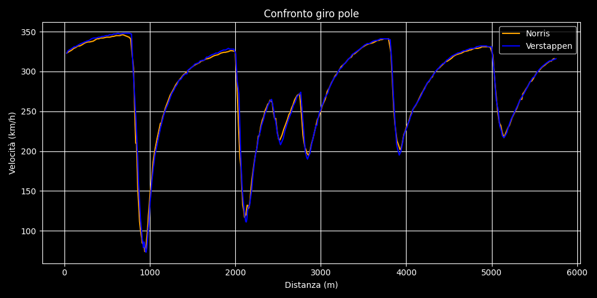

```python
"""
QUALIFYNG LAPTIME COMPARE

here is reported an example of how download data and create a graph to compare driver's best laptime during a qualifyng session
The user must use:
fastF1 API to download data
matplotlib to create the plot

ENJOY
ALESSANDRO ERMONDE LEONE
"""

import fastf1
from fastf1 import plotting
import matplotlib.pyplot as plt


# Enable caching to avoid downloading everything every time.
fastf1.Cache.enable_cache('../cache')

# Setup plot style
plotting.setup_mpl()

# Upload a session (ex. GP Monza 2025, Qualifyng)
session = fastf1.get_session(2025, 'Monza', 'Q')
session.load()

# Select driver's laptimes
laps_norris = session.laps.pick_driver('NOR')
laps_verstappen = session.laps.pick_driver('VER')

# pick the best laps
best_norris= laps_norris.pick_fastest()
best_verstappen = laps_verstappen.pick_fastest()

# get telemetry
tel_nor = best_norris.get_car_data().add_distance()
tel_ver= best_verstappen.get_car_data().add_distance()
pos_nor = best_norris.get_pos_data()
pos_ver  = best_verstappen.get_pos_data()

# === 1. Speed Compare ===
plt.style.use('dark_background')
plt.figure(figsize=(10, 5))
plt.plot(tel_nor['Distance'], tel_nor['Speed'], label='Norris',  color='orange')
plt.plot(tel_ver['Distance'], tel_ver['Speed'], label='Verstappen', color='blue')
plt.xlabel('Distanza (m)')
plt.ylabel('Velocità (km/h)')
plt.title('Confronto giro pole')
plt.legend()
plt.grid(True)
plt.tight_layout()
plt.show()
```

